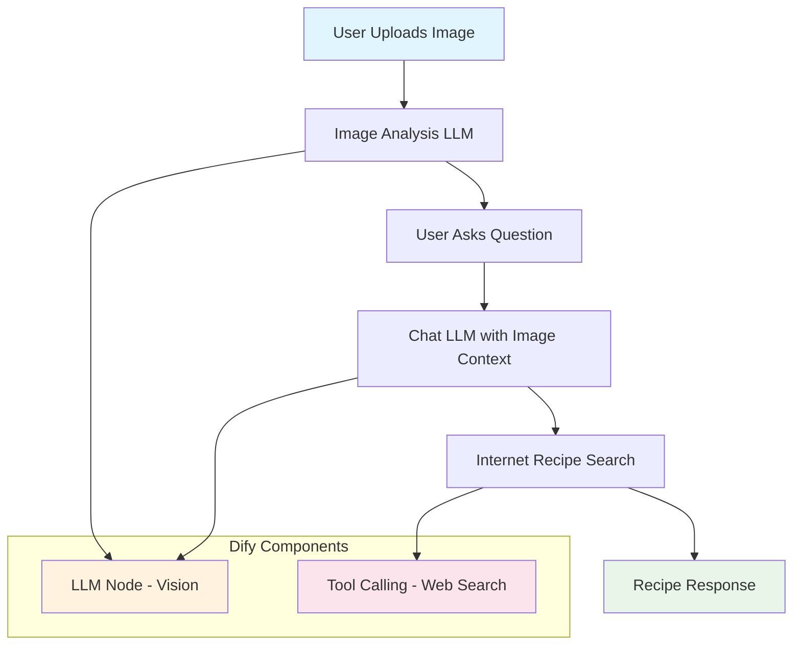

# Dify Setup Instructions - What Can I Cook? Demo

Complete step-by-step instructions to set up your Dify application for the focused "What Can I Cook?" demo.

## Prerequisites

- Dify account and access to Dify dashboard
- Basic understanding of Dify app configuration

## Step 1: Create New Chat Application

1. **Login to Dify Dashboard**
   - Go to [Dify Dashboard](https://dify.ai)
   - Login with your account

2. **Create New App**
   - Click "Create App" button
   - Select "Chat App" as the application type
   - Choose "Advanced Chat" for multimodal capabilities

3. **Basic Configuration**
   - **App Name**: `What Can I Cook?`
   - **App Description**: `Simple ingredients-to-recipe suggestion tool`
   - **App Icon**: Choose a simple cooking/food icon

## Step 2: Configure App Settings

### General Settings

- **App Mode**: Advanced Chat
- **Language**: English (or your preferred language)
- **Timezone**: Set to your local timezone

### API Settings

- **Response Mode**: Both Streaming and Blocking
- **User Input Form**: Enable
- **File Upload**: Enable (Required for image analysis)
- **File Types**: Images only (PNG, JPG, JPEG, WEBP, GIF)

## Step 3: Configure Agent Workflow

### Workflow Diagram

Here's the simplified visual representation of the "What Can I Cook?" demo workflow:



### Required Dify Components

For this demo, you'll need to configure these components in your Dify workflow:

1. **LLM Node** - For image analysis and recipe generation
2. **Tool Calling** - For internet-based recipe search

### Workflow Configuration Steps

1. **Create Workflow**
   - Go to "Workflow" section in Dify dashboard
   - Create new "Agent Workflow"
   - Name it "What Can I Cook Workflow"

2. **Add LLM Node**
   - Drag LLM node to canvas
   - Configure model: GPT-4 Vision or Claude 3 Vision
   - Set prompt: "Analyze the uploaded image and identify all visible ingredients"

3. **Add Tool Calling**
   - Drag Tool Calling node
   - Configure web search tool for recipe lookup
   - Set search parameters for recipe websites

4. **Connect Nodes**
   - Connect LLM → Tool Calling → Response
   - Set up simple linear flow

5. **Configure Variables**
   - Input: `user_query` (string)
   - Input: `uploaded_image` (file)
   - Output: `recipe_suggestion` (string)

### Dify Properties Configuration

#### LLM Node Properties

```json
{
  "model": "gpt-4-vision-preview",
  "temperature": 0.7,
  "max_tokens": 2000,
  "vision_enabled": true,
  "system_prompt": "You are a helpful cooking assistant..."
}
```

#### Tool Calling Properties

```json
{
  "tools_enabled": true,
  "max_tool_calls": 2,
  "tool_timeout": 15,
  "available_tools": ["web_search"],
  "search_domains": ["allrecipes.com", "foodnetwork.com", "epicurious.com"]
}
```

## Step 4: Configure System Prompt

Replace the default system prompt with this focused prompt:

```
You are a simple "What Can I Cook?" assistant. Your job is to help users figure out what they can cook with the ingredients they have.

## Core Purpose:
Help users turn their available ingredients into delicious recipes.

## What You Do:
1. **Analyze Ingredients**: Look at uploaded photos and identify what ingredients are available
2. **Suggest Recipes**: Recommend simple, practical recipes they can make
3. **Provide Instructions**: Give clear, step-by-step cooking instructions
4. **Answer Questions**: Help with cooking tips and modifications

## Guidelines:
- Keep suggestions simple and practical
- Focus on recipes that are actually doable with their ingredients
- Be encouraging and helpful
- Don't overcomplicate - this is about quick inspiration, not complex meal planning
- Consider dietary restrictions and preferences when asked
- Provide practical, achievable recipes
- Include nutritional information when relevant
- Suggest healthy alternatives when appropriate
- Be mindful of food waste and budget considerations

## Response Format:
- Start by analyzing what you see in the image
- Provide specific recipe suggestions with clear instructions
- Include estimated cooking time and difficulty level
- Offer nutritional insights and health benefits
- Suggest complementary ingredients or substitutions

Remember: You're helping people make the most of their available food while maintaining a healthy, balanced diet.
```

## Step 4: Configure Knowledge Base (Optional but Recommended)

### Option A: Upload Recipe Database

1. **Create Knowledge Base**
   - Go to "Knowledge" section
   - Click "Create Knowledge Base"
   - Name: `Recipe Database`

2. **Upload Recipe Files**
   - Upload CSV/JSON files with recipe data
   - Include fields: name, ingredients, instructions, nutrition, cooking_time
   - Or upload recipe websites/documents

### Option B: Use Web Search (Simpler)

1. **Enable Web Search**
   - Go to "Tools" section
   - Enable "Web Search" tool
   - This allows real-time recipe lookups

## Step 5: Configure Tools and Integrations

### Required Tools

1. **File Upload Tool**
   - Ensure file upload is enabled
   - Set file size limit: 10MB
   - Supported formats: PNG, JPG, JPEG, WEBP, GIF

2. **Image Analysis Tool**
   - Enable image analysis capabilities
   - Configure to extract text and identify objects
   - Set confidence threshold: 0.7

### Optional Tools

1. **Web Search** (if not using knowledge base)
2. **Calculator** (for nutritional calculations)
3. **Calendar** (for meal planning)

## Step 6: Configure Conversation Settings

### Conversation Management

- **Enable Conversation History**: Yes
- **Max Conversation Turns**: 50
- **Conversation Timeout**: 24 hours
- **Enable Suggested Questions**: Yes

### Suggested Questions Setup

Configure these default suggested questions:

```
- "What can I make with these ingredients?"
- "Suggest a healthy meal plan for this week"
- "What's missing for a complete meal?"
- "Give me nutritional information about these foods"
- "Suggest budget-friendly alternatives"
```

## Step 7: Configure Model Settings

### Model Selection

- **Primary Model**: GPT-4 Vision (for image analysis)
- **Fallback Model**: GPT-4 (for text-only interactions)
- **Temperature**: 0.7 (balanced creativity and consistency)

### Response Settings

- **Max Response Length**: 2000 tokens
- **Response Format**: Conversational
- **Enable Streaming**: Yes
- **Enable Citations**: Yes (if using knowledge base)

## Step 8: Test Your Configuration

### Test Cases

1. **Upload Test Image**
   - Upload a photo of common ingredients (tomatoes, onions, etc.)
   - Verify AI can identify the ingredients

2. **Recipe Request**
   - Ask: "What can I make with these ingredients?"
   - Verify AI provides specific recipe suggestions

3. **Meal Planning**
   - Ask: "Create a meal plan for this week"
   - Verify AI considers the available ingredients

4. **Nutritional Insights**
   - Ask: "What are the health benefits of these foods?"
   - Verify AI provides nutritional information

## Step 9: Deploy and Get API Key

1. **Deploy Application**
   - Click "Deploy" button
   - Wait for deployment to complete

2. **Get API Key**
   - Go to "API" section
   - Copy your API Key
   - Format: `app-xxxxxxxxxxxxxxxx`

3. **Test API**
   - Use the API testing interface
   - Test file upload and chat functionality

## Step 10: Environment Configuration

Add these environment variables to your project:

```bash
# Dify Configuration
DIFY_API_KEY=app-your-api-key-here
DIFY_BASE_URL=https://api.dify.ai/v1
DIFY_APP_MODE=chat
```

## Troubleshooting

### Common Issues

1. **Image Analysis Not Working**
   - Verify GPT-4 Vision model is selected
   - Check file upload settings
   - Ensure image format is supported

2. **Poor Recipe Suggestions**
   - Improve system prompt specificity
   - Add more recipe data to knowledge base
   - Adjust temperature settings

3. **API Errors**
   - Verify API key is correct
   - Check rate limits
   - Ensure app is deployed

### Performance Optimization

1. **Response Speed**
   - Use streaming mode for better UX
   - Optimize image sizes before upload
   - Cache common responses

2. **Cost Management**
   - Monitor token usage
   - Use appropriate model for each task
   - Implement rate limiting

## Next Steps

Once your Dify app is configured:

1. **Test Thoroughly**: Upload various food images and test different scenarios
2. **Refine Prompts**: Adjust system prompt based on test results
3. **Add More Data**: Continuously improve your knowledge base
4. **Monitor Usage**: Track performance and user feedback

## Support

- **Dify Documentation**: [docs.dify.ai](https://docs.dify.ai)
- **Community Forum**: [forum.dify.ai](https://forum.dify.ai)
- **API Reference**: [api.dify.ai](https://api.dify.ai)

Your Smart Recipe Analyzer is now ready to help users plan amazing meals! 🍳
